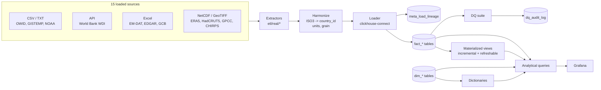
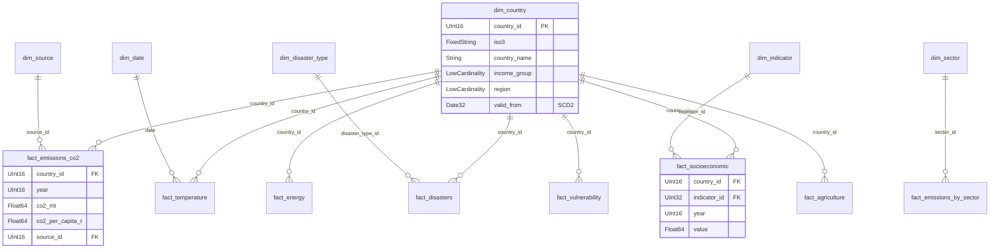
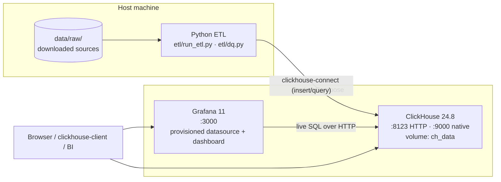

# Architecture

## Overview

The warehouse is a **star schema** on ClickHouse: conformed dimensions at the centre of many fact tables, one fact table per measurement grain/theme. Source data is heterogeneous (CSV, Excel, NetCDF, GeoTIFF, API; daily/monthly/annual; station/gridded/country), so the ETL layer harmonizes everything to a common country + time grain before loading.

```
 Sources (15 loaded)     ETL (Python)                 ClickHouse                Presentation
┌────────────┐   download   ┌──────────────┐  insert  ┌────────────────┐       ┌──────────┐
│ OWID, WDI, │ ───────────▶ │ extract →    │ ───────▶ │ dim_* (6)      │       │ Grafana  │
│ NOAA, NASA,│              │ parse →      │          │ fact_* (12)    │ ────▶ │ 9 panels │
│ EM-DAT,    │   ISO3        │ harmonize →  │          │ MVs (6)        │       │ 6 themes │
│ ERA5, GPCC,│   country_id  │ load + log   │          │ dictionaries   │       └──────────┘
│ EDGAR, ... │ ───────────▶ │ lineage      │          │ dq_audit_log   │
└────────────┘              └──────────────┘          └────────────────┘
```

## Data flow



## Star schema



The full table inventory is in [`data_dictionary.md`](data_dictionary.md).

## Deployment

The runtime is two Docker containers plus the ETL process on the host. ClickHouse
holds the warehouse; Grafana queries it live over HTTP; the Python ETL connects
from the host to load data and run the quality suite.



Configuration lives in `docker-compose.yml` (services, ports, volume) and
`docker/clickhouse/users.d/` (user + experimental settings, incl. refreshable
materialized views). ClickHouse data persists in a named Docker volume, so the
warehouse survives `make down` / `make up`.

## ClickHouse design decisions

**Engines.** Facts use `ReplacingMergeTree(_inserted_at)` so re-running an ETL load is idempotent — the newest insert for a key wins after merges. Dimensions use `ReplacingMergeTree(_version)`. Aggregated MV targets use `SummingMergeTree` (additive rollups: emissions/disaster counts by decade) and `AggregatingMergeTree` (mergeable states: average temperature anomaly, average CO₂ ppm).

**Sort keys / partitioning.** `ORDER BY` leads with the most selective filter columns (usually `country_id`, then time). Annual facts are partitioned by **decade** (`intDiv(year,10)*10`), monthly facts by decade-of-year — a deliberate choice to keep the partition count small (~15) while still enabling partition pruning on time-range queries.

**Multi-source coexistence.** Facts that legitimately receive more than one source (CO₂ from OWID + Global Carbon Budget; temperature from GISTEMP + HadCRUT5 + ERA5; precipitation from GPCC + CHIRPS) include `source_id` **in the sort key**, so the sources coexist rather than overwrite. This is what powers the cross-source **reconciliation** data-quality check (OWID vs GCB).

**Date range.** ClickHouse `Date` only covers 1970–2149; climate series reach back to the 19th century and the SCD2 sentinel is far in the future, so all date columns use **`Date32`** (1900–2299) and pre-1900 records are clipped at load.

**Dictionaries.** `dim_country`, `dim_indicator`, and `dim_disaster_type` are exposed as in-memory `HASHED()` dictionaries, so hot lookups (income group, region, indicator name) use `dictGet` instead of a JOIN — keeping wide analytical queries sub-second.

**Materialized views.** Five incremental MVs pre-aggregate on insert (decade emissions, annual temperature, annual CO₂, disasters by type/decade, annual energy mix). One **refreshable** MV (`mv_country_year_overview`) rebuilds a wide denormalized country-year table on a schedule by JOINing four facts — the workhorse behind several dashboard panels.

## Lineage & data quality

Every fact row carries `source_id` → `dim_source`. Each load run appends to `meta_load_lineage` (rows loaded, timing, status, access date). The DQ suite (`etl/dq.py`) runs 11 checks across five categories — completeness, referential integrity, range, uniqueness, cross-source reconciliation — and logs each result with pass/fail vs. threshold to `dq_audit_log`.
