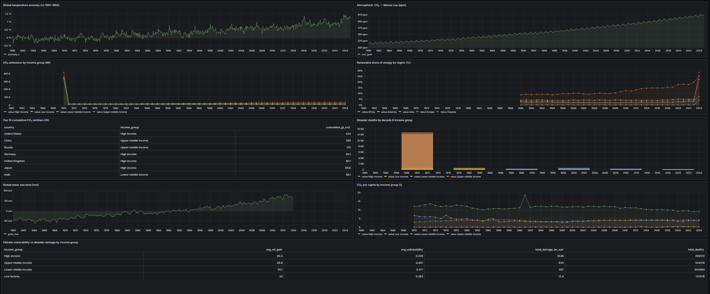
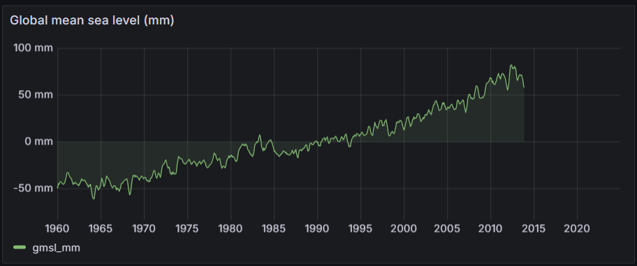

# User Guide

A practical walkthrough of what the warehouse can answer and how to use it,
once it is installed (see [`installation.md`](installation.md)) and populated.

---

## Who this is for

Anyone wanting to ask **cross-domain climate questions** — how emissions track
GDP, who is most exposed to disasters, how fast regions are decarbonising —
without first downloading and reconciling a dozen incompatible datasets. The
warehouse has already harmonised 15 global sources to a common country + time
grain.

## 1. Confirm the warehouse is ready

```bash
make ps        # ClickHouse + Grafana should be "healthy"
docker compose exec clickhouse clickhouse-client --password climate --database climate \
  --query "SELECT count(DISTINCT source_id) AS sources, sum(rows_loaded) AS rows
           FROM meta_load_lineage WHERE status='SUCCESS'"
```

You should see 15 sources and ~3.34M rows. If not, load data first
(`make bootstrap`, then the file/gridded groups — see the installation guide).

## 2. Three ways to query

1. **Grafana** (no SQL) — the fastest way to explore visually. Open
   <http://localhost:3000> → dashboard *Global Climate Data Warehouse — Overview*.
2. **clickhouse-client** (SQL, terminal):
   ```bash
   docker compose exec clickhouse clickhouse-client --password climate --database climate
   ```
3. **HTTP / Python / BI tools** — connect to `localhost:8123`. See
   [`query_reference.md`](query_reference.md) for connection details.

---

## 3. Worked use cases

Each example uses a query from the curated library
(`sql/queries/analytical_queries.sql`). Paste it into `clickhouse-client`, or
run the whole library with timings via `make validate`.

### Use case A — "Is any country growing its economy while cutting emissions?"

Run **Q7 (Decoupling)**. It compares each country's CO₂ change and GDP change
between 2000 and 2020 and returns only those with *falling emissions and rising
GDP* (absolute decoupling), ranked by GDP growth. Expect a short list of mostly
high-income European economies.

### Use case B — "Who bears historical responsibility for CO₂?"

Run **Q2 (Top 15 cumulative emitters)**. Returns the largest all-time emitters
in gigatonnes, with each country's income group — useful for the
responsibility-vs-capacity narrative.

### Use case C — "Are poorer countries hit harder by disasters?"

Run **Q3** (deaths/damage by income group and decade) and **Q8** (disaster
damage vs ND-GAIN vulnerability). Together they show how exposure and impact
differ across income groups.

### Use case D — "How tightly does warming track CO₂?"

Run **Q5 (temperature anomaly vs atmospheric CO₂)** — one row per year combining
the global temperature-anomaly and Mauna Loa CO₂ series. This is the classic
"hockey stick" pairing and reads from two materialized views, so it returns
near-instantly.

---

## 4. Using the Grafana dashboard

Open <http://localhost:3000>. The ClickHouse datasource and the overview
dashboard are auto-provisioned — no login or setup needed for local use.



The dashboard has **9 panels across all six themes**: temperature trend, CO₂
concentration, emissions by country, energy mix, disasters, vulnerability,
agriculture, sea level, and a cross-domain overview.

**Common actions**

- **Change the time range** — top-right time picker; panels re-query live.
- **Focus a country/region** — use the dashboard variables at the top.
- **Inspect a panel's SQL** — panel title → *Edit*; every panel is a plain
  ClickHouse query you can copy.
- **Export** — panel menu → *Inspect → Data → Download CSV*.



> If a panel shows *No data*, that source has not been loaded yet (e.g. sea
> level needs CSIRO). Load it (`make load-file`) and refresh.

---

## 5. Refreshing or extending the data

- **Reload a source** — loads are idempotent (ReplacingMergeTree); just re-run
  `python -m etl.run_etl --sources <name>`.
- **Add a new source** — see [`../CONTRIBUTING.md`](../CONTRIBUTING.md).
- **Re-check quality after any load** — `make dq`.

## 6. Troubleshooting

See the Troubleshooting section of [`installation.md`](installation.md) for the
common cases (`Connection refused`, refreshable-MV settings, missing downloads,
unmatched countries).
